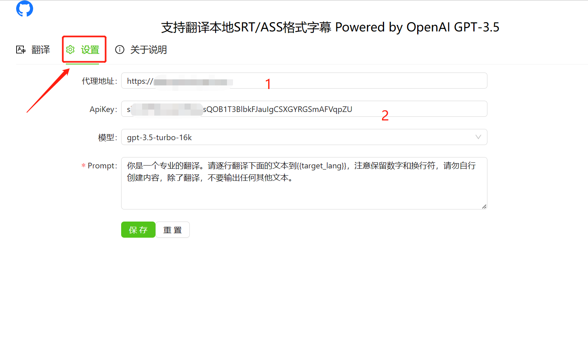

- 项目基于[AISubtitle](https://github.com/cgsvv/AISubtitle) 开发

# 新增

- [x] 自定义`Base Host`
- [x] 自定义`模型`
- [x] 自定义`prompt`

# 使用申明

该项目改为本地`直连`Api 地址，如果使用中转和反代，请检查跨域问题。

# 使用步骤

## 1、情况说明

#### a、自有 Api key 和 【本地环境】支持的

- 把下图 2 设置为: `sk-xxxxxxxx`
- 把下图 1 设置为: `https://api.openai.com`

#### b、有自建反代的

- 把下图 1 设置为你的地址: `https://xxxx.xxxxx.com`

#### c、中转的

- 把下图 2 设置为`中转`的 key: `xxxxxxxx`
- 把下图 1 设置为`中转`的地址: `https://xxxx.xxxxx.com`

## 2、推荐设置

建议把模型改为`16k`版本，如果你有`gpt-4`权限，可直接切换至`gpt-4`模型使用
